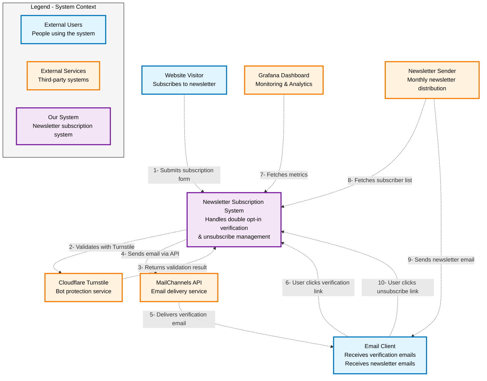
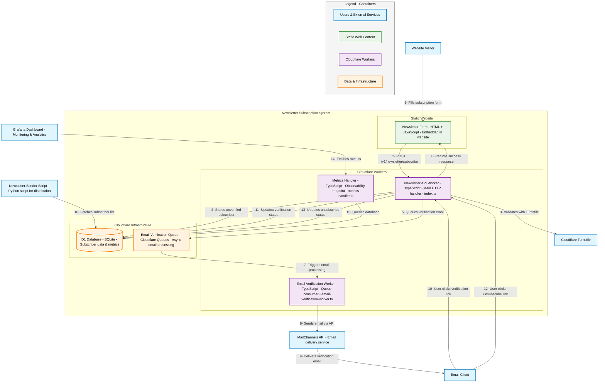
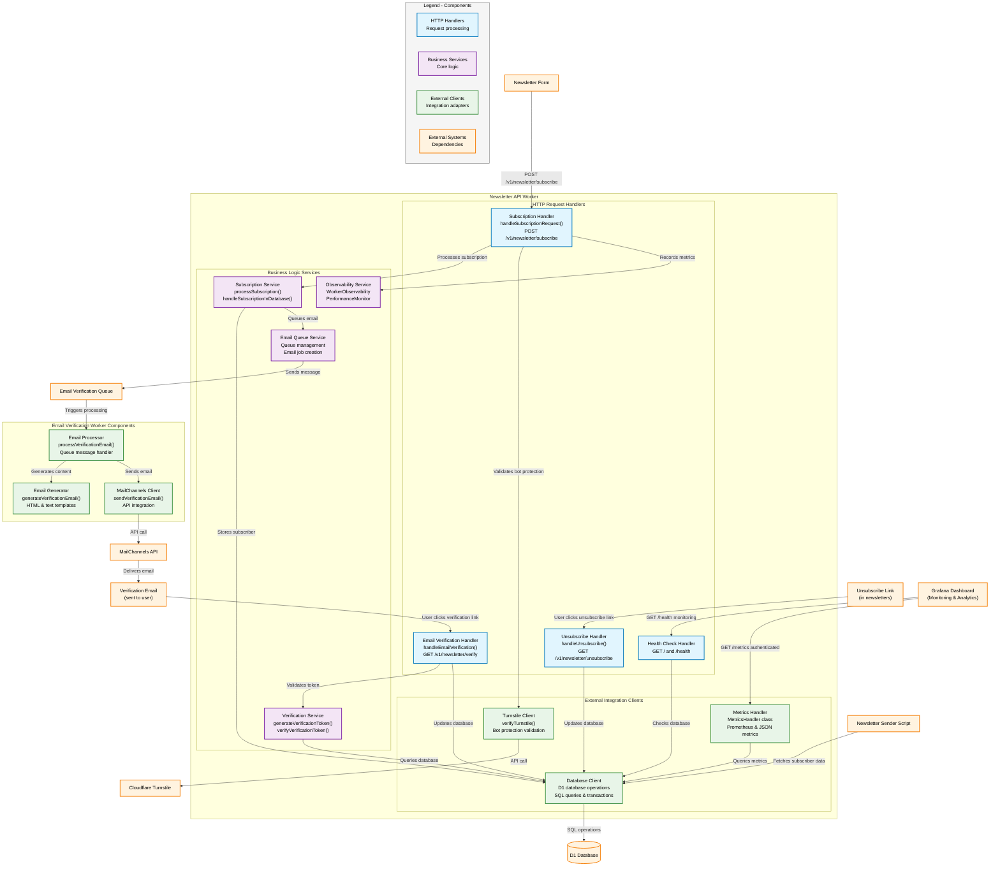

# Newsletter Subscription Service - Design Specification Document

## 1. Project Overview

### 1.1 Purpose
Create a newsletter subscription service for a MkDocs static website hosted on Cloudflare, allowing users to subscribe to monthly summaries of interesting content with links to detailed articles.

### 1.2 Scope

- Newsletter signup page integrated with MkDocs site
- Cloudflare Worker for subscription processing
- Cloudflare Worker for unsubscribe processing
- Bot/spam protection using Cloudflare Turnstile
- Subscriber data storage in Cloudflare D1 database
- Cloudflare worker to send (second factor) verification via email
- Cloudflare worker for verification via email link

### C4 Model

The C4 model is a lean graphical notation technique for modeling the architecture of software systems.
This model helps in visualizing software architecture at varying levels of detail, enhancing communication and collaboration within development teams. It is designed to be easy to learn and developer-friendly, making it effective for onboarding and architecture reviews.

It consists of four levels:

 * Context - a high-level overview of the system and its interactions with external entities
 * Container - the applications and data stores within it
 * Component - internal components of a container, mapping them to code abstractions
 * Code (Optional) -  detailed implementation documentation


#### System Context View



#### Container view



#### Component View



#### Code View

```mermaid
graph TB
    %% External Components
    SubscribeHandler["Subscription Handler"]
    VerifyHandler["Email Verification Handler"]
    UnsubscribeHandler["Unsubscribe Handler"]
    MetricsHandler["Metrics Handler"]
    EmailWorker["Email Verification Worker"]
    MailChannels["MailChannels API"]
    Grafana["Grafana Dashboard"]
    NewsletterSender["Newsletter Sender Script"]

    %% Core Business Logic Methods
    ProcessSubscription["processSubscription()"]
    HandleSubscriptionInDB["handleSubscriptionInDatabase()"]
    ValidateEmail["isValidEmail()"]
    NormalizeEmail["normalizeEmail()"]

    %% Token Management Methods
    GenerateToken["generateVerificationToken()"]
    VerifyToken["verifyVerificationToken()"]
    VerifyUnsubscribeToken["verifyUnsubscribeToken()"]

    %% Metrics & Observability Methods
    CollectDatabaseMetrics["collectDatabaseMetrics()"]
    CollectHealthMetrics["collectHealthMetrics()"]
    FormatPrometheus["formatPrometheusMetrics()"]
    HandlePrometheusQuery["handlePrometheusQuery()"]
    RecordMetric["recordMetric()"]

    %% Database Operations
    InsertSubscriber["INSERT INTO subscribers"]
    UpdateVerified["UPDATE SET email_verified=TRUE"]
    UpdateUnsubscribed["UPDATE SET unsubscribed_at=?"]
    FindByEmail["SELECT WHERE email=?"]
    CountSubscribers["SELECT COUNT(*) FROM subscribers"]
    CountActive["SELECT COUNT(*) WHERE unsubscribed_at IS NULL"]

    %% Email Operations
    QueueMessage["EMAIL_VERIFICATION_QUEUE.send()"]
    ProcessBatch["handleEmailVerificationQueue()"]
    HandleRetry["message.retry()"]
    SendMailChannels["sendVerificationEmail()"]
    GenerateEmailTemplate["generateVerificationEmail()"]

    %% Handler to Service Relationships
    SubscribeHandler --> ProcessSubscription
    SubscribeHandler --> ValidateEmail
    SubscribeHandler --> NormalizeEmail
    SubscribeHandler --> RecordMetric
    VerifyHandler --> VerifyToken
    VerifyHandler --> UpdateVerified
    VerifyHandler --> RecordMetric
    UnsubscribeHandler --> VerifyUnsubscribeToken
    UnsubscribeHandler --> UpdateUnsubscribed
    UnsubscribeHandler --> RecordMetric
    MetricsHandler --> CollectDatabaseMetrics
    MetricsHandler --> CollectHealthMetrics
    MetricsHandler --> FormatPrometheus
    MetricsHandler --> HandlePrometheusQuery

    %% Service to Service Relationships
    ProcessSubscription --> HandleSubscriptionInDB
    ProcessSubscription --> GenerateToken
    ProcessSubscription --> QueueMessage
    ProcessSubscription --> RecordMetric

    %% Service to Database Relationships
    HandleSubscriptionInDB --> InsertSubscriber
    HandleSubscriptionInDB --> FindByEmail
    UpdateVerified --> FindByEmail
    UpdateUnsubscribed --> FindByEmail
    CollectDatabaseMetrics --> CountSubscribers
    CollectDatabaseMetrics --> CountActive
    CollectHealthMetrics --> CountSubscribers

    %% Email Flow Relationships
    QueueMessage --> EmailWorker
    EmailWorker --> ProcessBatch
    ProcessBatch --> GenerateEmailTemplate
    ProcessBatch --> SendMailChannels
    ProcessBatch --> RecordMetric
    SendMailChannels --> MailChannels
    ProcessBatch --> HandleRetry

    %% External System Relationships
    Grafana --> MetricsHandler
    NewsletterSender --> CountActive

    %% Legend
    subgraph Legend["Legend - Code Level"]
        LegendMethod["Service Methods"]
        LegendDatabase["Database Operations"]
        LegendQueue["Queue & Email Operations"]
        LegendExternal["External Components"]
    end

    %% Styling
    classDef methodFlow fill:#e1f5fe,stroke:#0277bd,stroke-width:2px,color:#000
    classDef databaseFlow fill:#e8f5e8,stroke:#388e3c,stroke-width:2px,color:#000
    classDef queueFlow fill:#f3e5f5,stroke:#7b1fa2,stroke-width:2px,color:#000
    classDef externalFlow fill:#fff3e0,stroke:#f57c00,stroke-width:2px,color:#000
    classDef legendBox fill:#f5f5f5,stroke:#666,stroke-width:1px,color:#000

    %% Apply styling to methods
    class ProcessSubscription,HandleSubscriptionInDB,ValidateEmail,NormalizeEmail,GenerateToken,VerifyToken,VerifyUnsubscribeToken,CollectDatabaseMetrics,CollectHealthMetrics,FormatPrometheus,HandlePrometheusQuery,RecordMetric methodFlow

    %% Apply styling to database operations
    class InsertSubscriber,UpdateVerified,UpdateUnsubscribed,FindByEmail,CountSubscribers,CountActive databaseFlow

    %% Apply styling to queue operations
    class QueueMessage,ProcessBatch,HandleRetry,SendMailChannels,GenerateEmailTemplate queueFlow

    %% Apply styling to external components
    class SubscribeHandler,VerifyHandler,UnsubscribeHandler,MetricsHandler,EmailWorker,MailChannels,Grafana,NewsletterSender externalFlow

    %% Apply styling to legend
    class Legend,LegendMethod,LegendDatabase,LegendQueue,LegendExternal legendBox

    %% Apply legend colors
    class LegendMethod methodFlow
    class LegendDatabase databaseFlow
    class LegendQueue queueFlow
    class LegendExternal externalFlow
```



###### Code-Level Components:

###### 🔵 Service Methods (Blue)

Subscription: createUnverifiedSubscriber(), validateEmailFormat(), queueVerificationEmail()
Verification: generateVerificationToken(), validateVerificationToken(), markSubscriberAsVerified()
Metrics: getSubscriberStats(), getHealthMetrics(), formatPrometheusMetrics(), getPerformanceMetrics()

###### 🟢 Database Operations (Green)

Subscription: INSERT INTO subscribers, SELECT WHERE email=?
Verification: SELECT WHERE token=?, UPDATE SET verified=TRUE
Metrics: SELECT COUNT(*) FROM subscribers

###### 🟣 Queue & Email Operations (Purple)

Queue: queue.send(), queue.consume(), message.retry()
Email: buildVerificationEmail(), smtp.sendMail()

###### 🟠 External Components (Orange)

Handlers: SubscribeHandler, VerifyHandler, MetricsHandler
External Systems: Grafana, SMTP Service, Email Worker

##### Key Flows:

Subscription: SubscribeHandler → createUnverifiedSubscriber() → INSERT INTO subscribers
Verification: VerifyHandler → validateVerificationToken() → SELECT WHERE token=?
Metrics: Grafana → MetricsHandler → getSubscriberStats() → SELECT COUNT(*)
Email: queueVerificationEmail() → queue.send() → EmailWorker → smtp.sendMail()

## 2. Functional Requirements

### 2.1 Newsletter Content
- **Type**: Monthly summary with links to interesting content
- **Frequency**: Monthly
- **Content**: Curated links and summaries of topics the author finds interesting

### 2.2 Subscription Process
- **Data Collection**: Email address only
- **Bot Protection**: Cloudflare Turnstile integration (auto theme)
- **Success Behavior**: Show success message directly below form
- **Duplicate Handling**: Show success message and update subscription timestamp
- **Form Behavior**: Submit button disabled with "Subscribing..." text during processing
- **Timezone**: All timestamps in GMT
- **Integration**: HTML forms embedded in Markdown pages via MkDocs

### 2.3 Unsubscribe Process
- **Method**: Unique unsubscribe links in each newsletter
- **Re-subscription**: Allow previously unsubscribed users to re-subscribe
- **Security**: Token-based unsubscribe links

### 2.4 Data Storage Requirements
- **Platform**: Cloudflare D1 database
- **Structure**: Single table tracking all subscriber states
- **Metadata**: IP address, user agent, geographic location
- **Timestamps**: Subscription date, unsubscription date (if applicable)

## 3. Technical Architecture

### 3.1 Components
1. **Newsletter Subscription Form** (HTML embedded in MkDocs Markdown)
2. **Shared JavaScript Handler** (loaded via MkDocs extra_javascript)
3. **Subscription Worker** (Cloudflare Worker - api.yourdomain.com)
4. **Unsubscribe Worker** (Cloudflare Worker - api.yourdomain.com)
5. **D1 Database** (Cloudflare D1)

### 3.2 Database Schema

```sql
CREATE TABLE subscribers (
    id INTEGER PRIMARY KEY AUTOINCREMENT,
    email TEXT UNIQUE NOT NULL,
    status TEXT NOT NULL CHECK (status IN ('subscribed', 'unsubscribed')),
    subscribed_at DATETIME NOT NULL,
    unsubscribed_at DATETIME NULL,
    ip_address TEXT,
    user_agent TEXT,
    country TEXT,
    city TEXT,
    created_at DATETIME DEFAULT CURRENT_TIMESTAMP,
    updated_at DATETIME DEFAULT CURRENT_TIMESTAMP
);

CREATE INDEX idx_email ON subscribers(email);
CREATE INDEX idx_status ON subscribers(status);
CREATE INDEX idx_subscribed_at ON subscribers(subscribed_at);
```

### 3.3 Unsubscribe Token Generation
- **Method**: HMAC-SHA256 based tokens
- **Components**: email + timestamp + secret key
- **Expiration**: No expiration (tokens remain valid)
- **Format**: Base64 encoded for URL safety

## 4. User Interface Requirements

### 4.1 Newsletter Subscription Form (HTML Template)
```html
<div class="newsletter-signup">
    <form id="newsletter-form" class="newsletter-form">
        <div class="md-field">
            <label class="md-field__label" for="newsletter-email">Email Address</label>
            <input
                type="email"
                id="newsletter-email"
                name="email"
                class="md-field__input"
                required
                placeholder="Enter your email address"
            >
        </div>

        <div class="turnstile-container" id="turnstile-widget"></div>

        <button type="submit" class="md-button md-button--primary" id="newsletter-submit">
            Subscribe to Newsletter
        </button>
    </form>

    <div id="newsletter-message" class="newsletter-message" style="display: none;"></div>
</div>
```

### 4.2 JavaScript Integration
- **File**: `newsletter.js` loaded via MkDocs `extra_javascript`
- **Styling**: Inherits Material Design theme (light/dark mode support)
- **Turnstile**: Auto theme matching Material Design mode
- **Form Handling**: Prevents default submission, uses fetch API for AJAX requests

### 4.3 Success Message
```
✅ Thank you for subscribing! You'll receive our monthly newsletter with interesting content and links.
```

### 4.4 Error Messages

#### Turnstile Verification Failed
```
❌ Please complete the security verification. If you're having trouble, visit our troubleshooting guide for help.
```

#### Maintenance Error
```
🔧 Our subscription service is temporarily unavailable for maintenance. Please try again later.
```

#### Technical Error
```
⚠️ An error occurred while processing your subscription. Please try again or contact support if the problem persists.
```

### 4.5 Loading States
- **Submit Button**: Text changes to "Subscribing..." and button becomes disabled
- **Form**: Maintains visual state during processing
- **Messages**: Clear previous messages before showing new ones

## 5. API Endpoints

### 5.1 Subscription Endpoint
- **URL**: `https://api.yourdomain.com/v1/newsletter/subscribe`
- **Method**: POST
- **Content-Type**: application/json
- **CORS**: Allows requests from `www.rnwolf.net`

**Request Body:**
```json
{
    "email": "user@example.com",
    "turnstileToken": "TURNSTILE_RESPONSE_TOKEN"
}
```

**Response Headers:**
```
Access-Control-Allow-Origin: https://www.rnwolf.net
Access-Control-Allow-Methods: POST, OPTIONS
Access-Control-Allow-Headers: Content-Type
```

**Response (Success):**
```json
{
    "success": true,
    "message": "Thank you for subscribing! You'll receive our monthly newsletter with interesting content and links."
}
```

**Response (Error):**
```json
{
    "success": false,
    "error": "TURNSTILE_FAILED|MAINTENANCE|TECHNICAL_ERROR",
    "message": "Appropriate error message",
    "troubleshootingUrl": "https://www.rnwolf.net/troubleshooting" // Only for TURNSTILE_FAILED
}
```

### 5.2 Unsubscribe Endpoint
- **URL**: `https://api.yourdomain.com/v1/newsletter/unsubscribe`
- **Method**: GET
- **Parameters**: `?token=UNSUBSCRIBE_TOKEN&email=EMAIL`
- **CORS**: Allows requests from any origin (for email client compatibility)

**Response (Success):**
```html
<!DOCTYPE html>
<html>
<head>
    <title>Unsubscribed - Newsletter</title>
    <meta name="viewport" content="width=device-width, initial-scale=1.0">
</head>
<body>
    <h1>Successfully Unsubscribed</h1>
    <p>You have been unsubscribed from our newsletter.</p>
    <p><a href="https://www.rnwolf.net/">Return to main site</a></p>
</body>
</html>
```

## 6. Security Requirements

### 6.1 Bot Protection
- **Service**: Cloudflare Turnstile
- **Implementation**: Client-side widget + server-side verification
- **Fallback**: Troubleshooting page link for verification issues
- **CSP Requirements**: Update Content Security Policy to allow:
  - `script-src 'self' challenges.cloudflare.com`
  - `frame-src 'self' challenges.cloudflare.com`
  - `connect-src 'self' challenges.cloudflare.com`

### 6.2 Data Protection
- **Email Storage**: Encrypted at rest (Cloudflare D1 default)
- **Token Security**: HMAC-SHA256 for unsubscribe tokens
- **CORS Security**: Restricted to www.rnwolf.net for subscription endpoint
- **Rate Limiting**: Cloudflare Worker built-in protection

### 6.3 Privacy Considerations
- **Duplicate Subscriptions**: No indication if email already exists
- **Unsubscribe**: Secure token-based system
- **Data Retention**: Keep unsubscribed records for compliance

## 7. Error Handling

### 7.1 Database Unavailable
- **Response**: Maintenance message
- **HTTP Status**: 503 Service Unavailable
- **Retry**: User can try again later

### 7.2 Turnstile Verification Failed
- **Response**: Error message with troubleshooting link
- **HTTP Status**: 400 Bad Request
- **Action**: User can retry verification

### 7.3 Network Timeouts
- **Response**: Technical error message
- **HTTP Status**: 500 Internal Server Error
- **Logging**: Full error details for debugging

## 8. Newsletter Distribution

### 8.1 Python Script Requirements
- **Purpose**: Retrieve subscriber data and generate newsletters with unsubscribe links
- **Database Access**: Connect to Cloudflare D1 via REST API
- **Token Generation**: Calculate HMAC-SHA256 unsubscribe tokens
- **Data Retrieval**: Query active subscribers and their subscription dates

### 8.2 D1 Database Connection from Python

**REST API Access:**
```python
import requests
import hmac
import hashlib
import base64
import json
import csv
from datetime import datetime
from pathlib import Path

# Cloudflare API Configuration
CLOUDFLARE_ACCOUNT_ID = "your_account_id"
CLOUDFLARE_API_TOKEN = "your_api_token"  # With D1:read permissions
D1_DATABASE_ID = "your_database_id"

def query_d1_database(sql_query):
    """Execute SQL query against Cloudflare D1 database"""
    url = f"https://api.cloudflare.com/client/v4/accounts/{CLOUDFLARE_ACCOUNT_ID}/d1/database/{D1_DATABASE_ID}/query"

    headers = {
        "Authorization": f"Bearer {CLOUDFLARE_API_TOKEN}",
        "Content-Type": "application/json"
    }

    payload = {
        "sql": sql_query
    }

    response = requests.post(url, headers=headers, json=payload)
    return response.json()

def get_active_subscribers():
    """Retrieve all active subscribers (those with subscribed_at but no unsubscribed_at)"""
    query = "SELECT email, subscribed_at FROM subscribers WHERE subscribed_at IS NOT NULL AND unsubscribed_at IS NULL"
    return query_d1_database(query)

def generate_unsubscribe_token(email, secret_key):
    """Generate HMAC-SHA256 unsubscribe token"""
    message = f"{email}"
    token = hmac.new(
        secret_key.encode('utf-8'),
        message.encode('utf-8'),
        hashlib.sha256
    ).hexdigest()
    return base64.urlsafe_b64encode(token.encode()).decode()

def create_unsubscribe_url(email, secret_key, base_url="https://api.yourdomain.com"):
    """Generate complete unsubscribe URL"""
    token = generate_unsubscribe_token(email, secret_key)
    return f"{base_url}/v1/newsletter/unsubscribe?token={token}&email={email}"

def save_subscribers_to_file(filename="subscribers.csv"):
    """Fetch subscribers from D1 and save to local CSV file"""
    print("Fetching subscribers from D1 database...")

    subscribers_data = get_active_subscribers()

    if not subscribers_data.get('success'):
        print("Error retrieving subscribers:", subscribers_data)
        return False

    subscribers = subscribers_data['result'][0]['results']
    print(f"Found {len(subscribers)} active subscribers")

    # Save to CSV file
    with open(filename, 'w', newline='', encoding='utf-8') as csvfile:
        fieldnames = ['email', 'subscribed_at', 'email_sent', 'sent_at']
        writer = csv.DictWriter(csvfile, fieldnames=fieldnames)

        writer.writeheader()
        for subscriber in subscribers:
            writer.writerow({
                'email': subscriber['email'],
                'subscribed_at': subscriber['subscribed_at'],
                'email_sent': 'False',
                'sent_at': ''
            })

    print(f"Subscribers saved to {filename}")
    return True

if __name__ == "__main__":
    save_subscribers_to_file()
```

### 8.3 Newsletter Generation Script Example

```python
#!/usr/bin/env python3
"""
Newsletter generation and distribution script
Features:
- Rate limited email sending
- Restartable (tracks progress in CSV file)
- Configurable SMTP settings
- Error handling and logging
"""

import os
import csv
import time
import smtplib
import logging
from email.mime.text import MIMEText
from email.mime.multipart import MIMEMultipart
from datetime import datetime
from pathlib import Path

# Import functions from previous script
from subscriber_fetcher import generate_unsubscribe_token, create_unsubscribe_url

# Configuration
HMAC_SECRET_KEY = os.getenv('HMAC_SECRET_KEY')
SMTP_SERVER = os.getenv('SMTP_SERVER', 'smtp.gmail.com')
SMTP_PORT = int(os.getenv('SMTP_PORT', '587'))
SMTP_USERNAME = os.getenv('SMTP_USERNAME')
SMTP_PASSWORD = os.getenv('SMTP_PASSWORD')
FROM_EMAIL = os.getenv('FROM_EMAIL')
FROM_NAME = os.getenv('FROM_NAME', 'Newsletter')

# Rate limiting (emails per minute)
EMAILS_PER_MINUTE = int(os.getenv('EMAILS_PER_MINUTE', '10'))
DELAY_BETWEEN_EMAILS = 60 / EMAILS_PER_MINUTE

# File settings
SUBSCRIBERS_FILE = "subscribers.csv"
LOG_FILE = "newsletter.log"

# Setup logging
logging.basicConfig(
    level=logging.INFO,
    format='%(asctime)s - %(levelname)s - %(message)s',
    handlers=[
        logging.FileHandler(LOG_FILE),
        logging.StreamHandler()
    ]
)

NEWSLETTER_TEMPLATE = """
<!DOCTYPE html>
<html>
<head>
    <title>Monthly Newsletter</title>
    <meta charset="utf-8">
    <style>
        body {{ font-family: Arial, sans-serif; line-height: 1.6; color: #333; }}
        .container {{ max-width: 600px; margin: 0 auto; padding: 20px; }}
        .header {{ border-bottom: 2px solid #eee; margin-bottom: 20px; }}
        .footer {{ border-top: 1px solid #eee; margin-top: 30px; padding-top: 20px; font-size: 12px; color: #666; }}
        a {{ color: #0066cc; }}
    </style>
</head>
<body>
    <div class="container">
        <div class="header">
            <h1>Monthly Interesting Links</h1>
            <p>Your curated collection of interesting content</p>
        </div>

        <div class="content">
            <!-- Newsletter content here -->
            <h2>This Month's Highlights</h2>
            <p>Here are some interesting links and thoughts from this month...</p>

            <!-- Add your actual newsletter content here -->

        </div>

        <div class="footer">
            <p>You subscribed to this newsletter on {subscription_date}.</p>
            <p><a href="{unsubscribe_url}">Unsubscribe</a> | <a href="https://www.rnwolf.net">Visit Website</a></p>
        </div>
    </div>
</body>
</html>
"""

def load_subscribers_from_file(filename=SUBSCRIBERS_FILE):
    """Load subscribers from CSV file"""
    if not Path(filename).exists():
        logging.error(f"Subscribers file {filename} not found. Run subscriber_fetcher.py first.")
        return []

    subscribers = []
    with open(filename, 'r', newline='', encoding='utf-8') as csvfile:
        reader = csv.DictReader(csvfile)
        for row in reader:
            subscribers.append(row)

    return subscribers

def update_subscriber_status(filename, email, status='True', sent_time=None):
    """Update the email_sent status for a specific subscriber"""
    if sent_time is None:
        sent_time = datetime.utcnow().isoformat()

    # Read all subscribers
    subscribers = []
    with open(filename, 'r', newline='', encoding='utf-8') as csvfile:
        reader = csv.DictReader(csvfile)
        for row in reader:
            if row['email'] == email:
                row['email_sent'] = status
                row['sent_at'] = sent_time
            subscribers.append(row)

    # Write back to file
    with open(filename, 'w', newline='', encoding='utf-8') as csvfile:
        fieldnames = ['email', 'subscribed_at', 'email_sent', 'sent_at']
        writer = csv.DictWriter(csvfile, fieldnames=fieldnames)
        writer.writeheader()
        writer.writerows(subscribers)

def create_newsletter_email(email, subscription_date):
    """Create newsletter email with unsubscribe link"""
    unsubscribe_url = create_unsubscribe_url(email, HMAC_SECRET_KEY)

    # Format subscription date for display
    try:
        # Parse ISO format from D1
        sub_date = datetime.fromisoformat(subscription_date.replace('Z', '+00:00'))
        formatted_date = sub_date.strftime("%B %d, %Y")
    except:
        formatted_date = subscription_date

    html_content = NEWSLETTER_TEMPLATE.format(
        subscription_date=formatted_date,
        unsubscribe_url=unsubscribe_url
    )

    # Create email message
    msg = MIMEMultipart('alternative')
    msg['Subject'] = f"Monthly Newsletter - {datetime.now().strftime('%B %Y')}"
    msg['From'] = f"{FROM_NAME} <{FROM_EMAIL}>"
    msg['To'] = email

    # Add HTML content
    html_part = MIMEText(html_content, 'html')
    msg.attach(html_part)

    return msg

def send_email_smtp(msg, recipient_email):
    """Send email via SMTP"""
    try:
        server = smtplib.SMTP(SMTP_SERVER, SMTP_PORT)
        server.starttls()
        server.login(SMTP_USERNAME, SMTP_PASSWORD)

        text = msg.as_string()
        server.sendmail(FROM_EMAIL, recipient_email, text)
        server.quit()

        return True, "Email sent successfully"

    except Exception as e:
        return False, str(e)

def send_newsletters():
    """Main function to send newsletters with rate limiting and restart capability"""
    if not all([HMAC_SECRET_KEY, SMTP_USERNAME, SMTP_PASSWORD, FROM_EMAIL]):
        logging.error("Missing required environment variables")
        return

    subscribers = load_subscribers_from_file()
    if not subscribers:
        logging.error("No subscribers found")
        return

    total_subscribers = len(subscribers)
    pending_subscribers = [s for s in subscribers if s['email_sent'].lower() != 'true']
    sent_count = total_subscribers - len(pending_subscribers)

    logging.info(f"Total subscribers: {total_subscribers}")
    logging.info(f"Already sent: {sent_count}")
    logging.info(f"Pending: {len(pending_subscribers)}")

    if not pending_subscribers:
        logging.info("All newsletters have been sent!")
        return

    # Confirm before starting
    response = input(f"Send newsletter to {len(pending_subscribers)} subscribers? (y/N): ")
    if response.lower() != 'y':
        logging.info("Newsletter sending cancelled")
        return

    success_count = 0
    error_count = 0

    for i, subscriber in enumerate(pending_subscribers, 1):
        email = subscriber['email']
        subscription_date = subscriber['subscribed_at']

        logging.info(f"Sending {i}/{len(pending_subscribers)} to {email}")

        try:
            # Create email
            msg = create_newsletter_email(email, subscription_date)

            # Send email
            success, message = send_email_smtp(msg, email)

            if success:
                # Update status in CSV
                update_subscriber_status(SUBSCRIBERS_FILE, email, 'True')
                success_count += 1
                logging.info(f"✓ Sent to {email}")
            else:
                error_count += 1
                logging.error(f"✗ Failed to send to {email}: {message}")
                # Mark as attempted but failed
                update_subscriber_status(SUBSCRIBERS_FILE, email, 'Failed')

        except Exception as e:
            error_count += 1
            logging.error(f"✗ Error sending to {email}: {str(e)}")
            update_subscriber_status(SUBSCRIBERS_FILE, email, 'Error')

        # Rate limiting - wait between emails
        if i < len(pending_subscribers):  # Don't wait after the last email
            logging.info(f"Waiting {DELAY_BETWEEN_EMAILS:.1f} seconds...")
            time.sleep(DELAY_BETWEEN_EMAILS)

    logging.info(f"Newsletter sending complete!")
    logging.info(f"Successful: {success_count}")
    logging.info(f"Errors: {error_count}")
    logging.info(f"Total processed: {success_count + error_count}")

def show_status():
    """Show current sending status"""
    subscribers = load_subscribers_from_file()
    if not subscribers:
        print("No subscribers file found")
        return

    total = len(subscribers)
    sent = len([s for s in subscribers if s['email_sent'].lower() == 'true'])
    failed = len([s for s in subscribers if s['email_sent'].lower() in ['failed', 'error']])
    pending = total - sent - failed

    print(f"Newsletter Status:")
    print(f"  Total subscribers: {total}")
    print(f"  Successfully sent: {sent}")
    print(f"  Failed: {failed}")
    print(f"  Pending: {pending}")

if __name__ == "__main__":
    import sys

    if len(sys.argv) > 1 and sys.argv[1] == 'status':
        show_status()
    else:
        send_newsletters()
```

### 8.4 Required Python Dependencies

```bash
pip install requests
```

### 8.5 Environment Variables for Newsletter Script

```bash
# .env file
CLOUDFLARE_ACCOUNT_ID=your_account_id
CLOUDFLARE_API_TOKEN=your_d1_api_token
D1_DATABASE_ID=your_database_id
HMAC_SECRET_KEY=your_hmac_secret_key  # Must match worker secret

# SMTP Configuration
SMTP_SERVER=smtp.gmail.com  # or your SMTP server
SMTP_PORT=587
SMTP_USERNAME=your_email@gmail.com
SMTP_PASSWORD=your_app_password
FROM_EMAIL=your_email@gmail.com
FROM_NAME=Your Newsletter Name

# Rate limiting
EMAILS_PER_MINUTE=10  # Adjust based on your SMTP provider limits
```

### 8.6 Usage Instructions

**Step 1: Fetch subscribers from D1**
```bash
python subscriber_fetcher.py
```
This creates `subscribers.csv` with all active subscribers and tracking fields.

**Step 2: Send newsletters**
```bash
python newsletter_sender.py
```
This sends emails with rate limiting and tracks progress in the CSV file.

**Step 3: Check status**
```bash
python newsletter_sender.py status
```
Shows how many emails have been sent, failed, or are pending.

**Restart capability**: If the script stops, simply run it again. It will skip subscribers who already received the newsletter and continue from where it left off.

### 8.7 Rate Limiting Considerations
- **Gmail**: ~100 emails/day for personal accounts, ~2000/day for Google Workspace
- **SendGrid**: Varies by plan, typically 100+ emails/day on free tier
- **Mailgun**: 5000 free emails/month
- **AWS SES**: Pay-per-email, very high limits

Adjust `EMAILS_PER_MINUTE` based on your provider's limits to avoid being rate limited or blocked.

### 8.8 D1 API Permissions
- **API Token Scope**: Account level with D1:read permissions
- **Security**: Use separate read-only token for newsletter script
- **Rate Limits**: Cloudflare API limits apply (check current limits)

### 8.1 Response Times
- **Subscription**: < 2 seconds under normal load
- **Unsubscribe**: < 1 second
- **Page Load**: Minimal impact on MkDocs site performance

### 8.2 Scalability
- **Cloudflare Workers**: Auto-scaling
- **D1 Database**: Suitable for expected newsletter subscriber volume
- **CDN**: Leverages Cloudflare's global network

## 10. Monitoring and Analytics

### 9.1 Key Metrics
- Subscription success rate
- Turnstile verification failure rate
- Unsubscribe rate
- Geographic distribution of subscribers

### 9.2 Logging
- All subscription attempts (success/failure)
- Turnstile verification failures
- Technical errors with full stack traces
- Unsubscribe activities

## 11. Deployment Considerations

### 10.1 Cloudflare Workers
- **Subscription Worker**: Deployed to `api.yourdomain.com/v1/newsletter/subscribe`
- **Unsubscribe Worker**: Deployed to `api.yourdomain.com/v1/newsletter/unsubscribe`
- **API Versioning**: v1 prefix allows for future breaking changes
- **Environment Variables**:
  - `TURNSTILE_SECRET_KEY`: Cloudflare Turnstile secret key
  - `HMAC_SECRET_KEY`: Secret key for generating unsubscribe tokens
  - `D1_DATABASE`: Binding to D1 database

### 10.2 DNS Configuration
- **Subdomain**: Create `api.yourdomain.com` CNAME pointing to workers
- **SSL**: Automatic SSL via Cloudflare
- **CORS**: Configure for www.rnwolf.net origin

### 10.3 MkDocs Integration
- **JavaScript File**: Add `newsletter.js` to `docs/javascripts/` directory
- **Configuration**: Update `mkdocs.yml`:
  ```yaml
  extra_javascript:
    - javascripts/newsletter.js
    - https://challenges.cloudflare.com/turnstile/v0/api.js
  ```
- **Form Placement**: Embed HTML forms in Markdown files as needed
- **Styling**: Inherits Material Design theme automatically

### 10.4 Database Migration
- **Initial Setup**: Create D1 database and run schema migration
- **Backup Strategy**: Regular exports for data protection
- **Testing**: Validate schema and worker integration on staging subdomain

### 11.5 CSP Header Updates
- **Current CSP Worker**: Update to include Turnstile domains
- **Required Additions**:
  ```
  script-src 'self' challenges.cloudflare.com;
  frame-src 'self' challenges.cloudflare.com;
  connect-src 'self' challenges.cloudflare.com;
  ```
- **Testing**: Verify Turnstile widget loads correctly with updated CSP
### 11.6 Turnstile Configuration
- **Site Key**: Configure for www.rnwolf.net domain
- **Theme**: Set to 'auto' for light/dark mode compatibility
- **Widget Placement**: Renders in designated container before submit button

## 12. Future Enhancements

### 11.1 Potential Features
- Subscription preferences (frequency, topics)
- Email templates for newsletters
- Analytics dashboard
- Export functionality for subscribers
- Double opt-in confirmation option

### 11.2 Scalability Considerations
- Migration to Cloudflare R2 for large subscriber lists
- Advanced segmentation capabilities
- Integration with email service providers
- A/B testing for signup forms